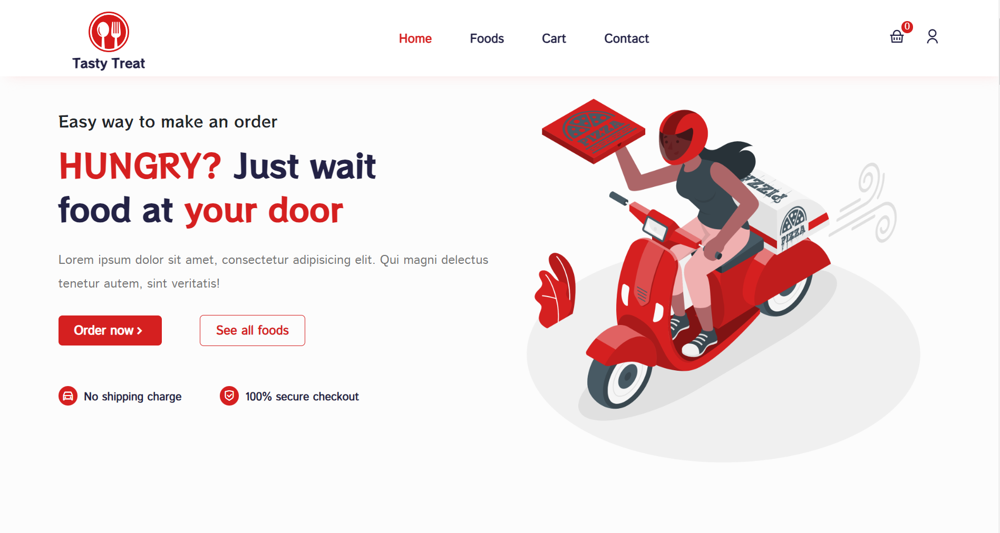

# Food Ordering App

<p align="center">
  
</p>

## Technologies Used:

1. React.js
2. Redux Toolkit
3. ReactStrap
4. CSS
5. Bootstrap

## How to Start?

To start the project, follow these simple steps:

1. Download the start-up file.
2. Open your terminal and navigate to the project directory.
3. Install all necessary dependencies:

    ```bash
    npm i
    ```

4. Run the project:

    ```bash
    npm start
    ```

This will initiate the development server, and you can access the Food Ordering App in your browser.

## Author:

Achraf Mechhour

## Contribution:

Feel free to explore the code and contribute to the development of this Food Ordering App. If you encounter any issues or have suggestions for improvement, please create an issue or submit a pull request.

## Feedback:

If you have any feedback or questions, feel free to reach out.

Happy coding!
